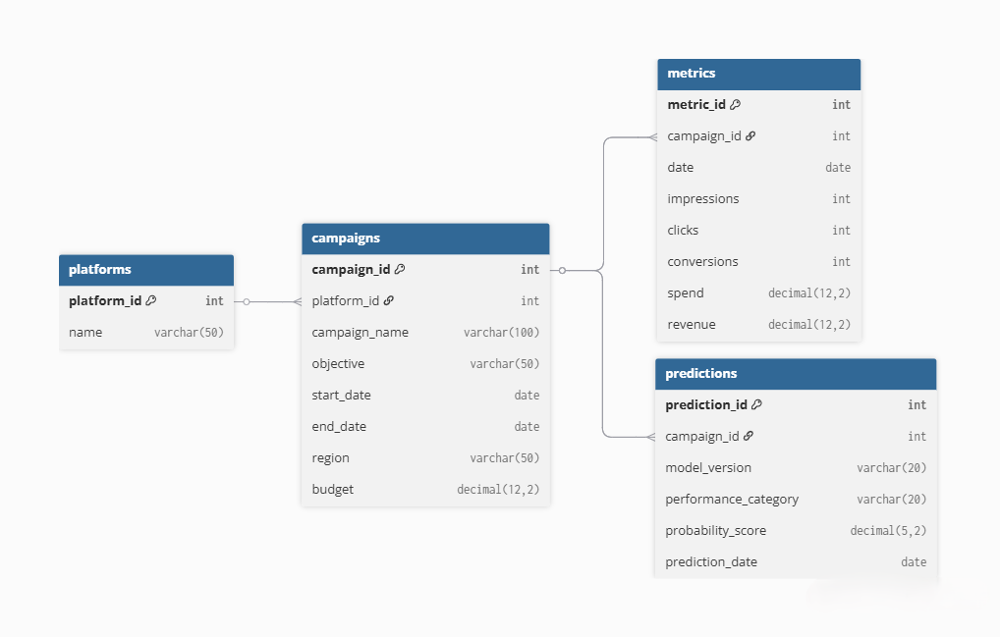

# AdWise360-Marketing-Campaign-Performance-Intelligence-System
**“AdWise360 – Turning raw marketing data into actionable intelligence for smarter ad decisions.”**

### Problem Statement

Digital marketing teams handle large, unstructured, and isolated datasets from multiple ad platforms.
Manually analyzing these to understand ROI, CTR, or conversion trends is time-consuming and error-prone.
AdWise360 aims to automate this process by providing a **centralized, intelligent performance tracking and prediction platform**.

### Overview

An end-to-end Marketing Analytics + Machine Learning dashboard built to analyze cross-platform ad campaigns (Google Ads, YouTube, Facebook) and predict future ROI using engineered features and a tuned Random Forest model.
This project combines SQL → ETL → Feature Engineering → ML → Streamlit Dashboard → Deployment, designed to simulate real ad-agency work

### Features

**Dashboard Analytics**
-KPI Cards: CTR, CPC, ROI, Impressions, Clicks
-Filters: Platform, Region, Objective
-Charts:
  -ROI Trend
  -Impressions vs Clicks
  -CTR vs ROI Scatter

**Machine Learning**
-Tuned Random Forest Regression
-Feature-engineered dataset
-Predicts campaign-level ROI
-ML features downloadable inside UI
-Clean predictions table

**Data Engineering**
-CSV-based ETL (Cloud-friendly)
-SQL DB schema 
-Synthetic dataset generator for campaigns & metrics
-Extensible to real Google/Facebook API later

**Deployment**
-Fully deployed on Streamlit Cloud
-Auto-detects missing DB and switches to CSV fallback
-Clean UI layout 

###Tech Stack

-Languages: Python, SQL, MySQL
-Libraries: Pandas, NumPy, Scikit-Learn, Streamlit, Altair, Joblib
-ML: Random Forest Regression (tuned), Feature Engineering
-Deployment: [Streamlit Cloud](https://share.streamlit.io/)
-Database Schema: [dbdiagram.io](https://dbdiagram.io/)

### Entity Relationship Diagram (ERD)

Here’s the database structure of the AdWise360 project:

  

#### Tables Overview

| Table | Description |
|--------|--------------|
| **platforms** | Stores ad platform details |
| **campaigns** | Contains campaign info like name, objective, region, and budget |
| **metrics** | Holds daily performance data — impressions, clicks, conversions, spend, and revenue |
| **predictions** | Stores machine learning results |

### Project Structure

AdWise360/
│
├── database/
│ ├── adwise360_schema.sql
│ ├── adwise360_test_data.sql
│ └── ERD_AdWise360.png
│
├── docs/
│ ├── Day1_Marketing_Analytics_Interview_Notes.docx
│ ├── Day2_Database_Design_Interview_Notes.docx
│
└── README.md

