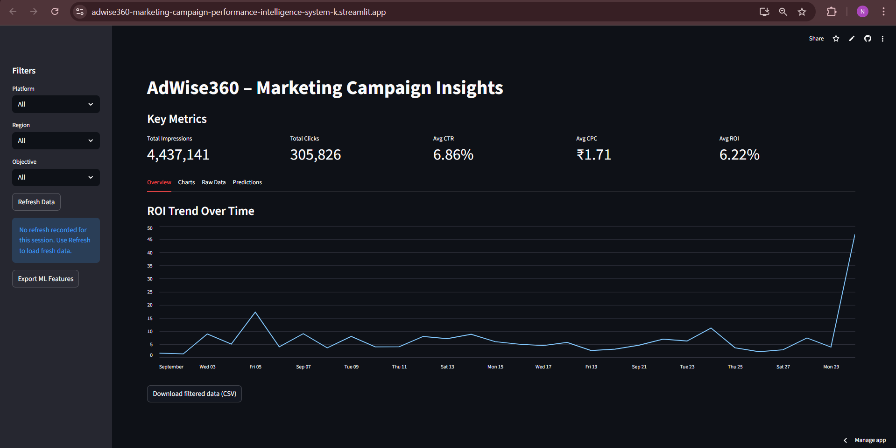
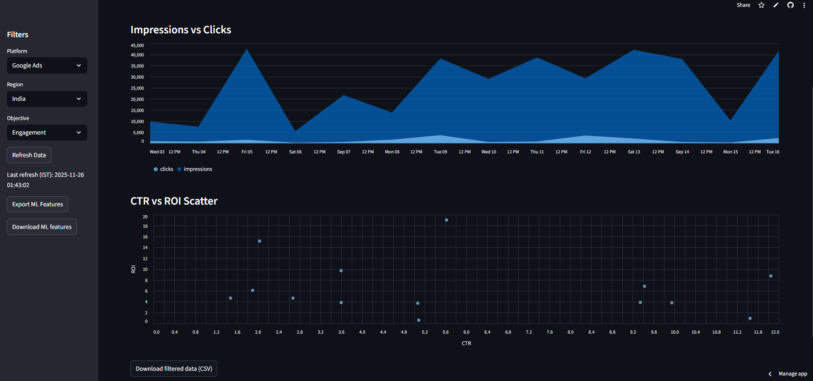

# AdWise360-Marketing-Campaign-Performance-Intelligence-System
**“AdWise360 – Turning raw marketing data into actionable intelligence for smarter ad decisions.”**

## Problem Statement
Digital marketing teams handle large, unstructured, and isolated datasets from multiple ad platforms.
Manually analyzing these to understand ROI, CTR, or conversion trends is time-consuming and error-prone.
AdWise360 aims to automate this process by providing a **centralized, intelligent performance tracking and prediction platform**.

## Table of Contents
- [Overview](#overview)
- [Features](#features)
- [Architecture](#architecture)
- [Tech Stack](#tech-stack)
- [Entity Relationship Diagram](#entity-relationship-diagram)
- [Machine Learning Pipeline](#machine-learning-pipeline)
- [Deployment](#deployment)
- [Live App URL](#live-app-url)
- [Screenshots](#screenshots)
- [How to Run Locally](#how-to-run-locally)
- [Future Improvements](#future-improvements)
- [Project Structure](#project-structure)

## Overview
An end-to-end Marketing Analytics + Machine Learning dashboard built to analyze cross-platform ad campaigns (Google Ads, YouTube, Facebook) and predict future ROI using engineered features and a tuned Random Forest model.
This project combines SQL → ETL → Feature Engineering → ML → Streamlit Dashboard → Deployment, designed to simulate real ad-agency work

## Features
#### Dashboard Analytics
- KPI Cards: **CTR, CPC, ROI, Impressions, Clicks**
- Filters: **Platform, Region, Objective**
- Charts:
  - ROI Trend
  - Impressions vs Clicks
  - CTR vs ROI Scatter

#### Machine Learning
- Tuned **Random Forest Regression**
- Feature-engineered dataset
- Predicts **campaign-level ROI**
- ML features downloadable inside UI
- Clean predictions table

#### Data Engineering
- **CSV-based ETL** (Cloud-friendly)
- **SQL DB schema**
- Synthetic dataset generator for campaigns & metrics
- Extensible to real **Google/Facebook Ads API** later

#### Deployment
- Fully deployed on **Streamlit Cloud**
- Auto-fallback:
  - Uses CSV when MySQL is not available on cloud
- Modular project structure:

## Tech Stack
- **Languages:** Python, SQL, MySQL  
- **Libraries:** Pandas, NumPy, Scikit-Learn, Streamlit, Altair, Joblib  
- **ML:** Random Forest Regression (tuned), Feature Engineering  
- **Deployment:** [Streamlit Cloud](https://share.streamlit.io/)  
- **Database Schema:** [dbdiagram.io](https://dbdiagram.io/)  

## Entity Relationship Diagram (ERD)
Here’s the database structure of the AdWise360 project:

  

## Tables Overview
| Table | Description |
|--------|--------------|
| **platforms** | Stores ad platform details |
| **campaigns** | Contains campaign info like name, objective, region, and budget |
| **metrics** | Holds daily performance data — impressions, clicks, conversions, spend, and revenue |
| **predictions** | Stores machine learning results |

## Machine Learning Pipeline
#### Target Variable
- `avg_roi` — the average Return on Investment per campaign.

#### 1. Data Preparation
- Load raw joined dataset (campaigns + metrics).
- Convert data types (dates, floats).
- Compute KPIs:
  - CTR = clicks / impressions  
  - CPC = spend / clicks  
  - ROI = (revenue – spend) / spend × 100  
- Remove invalid or zero-division rows safely.

#### 2. Feature Engineering
Engineered features include:
- Basic Aggregates
  - total_impressions  
  - total_clicks  
  - total_conversions  
  - total_spend  
  - total_revenue  
  - days_active  
- Rate Metrics
  - avg_ctr  
  - conv_rate  
  - avg_cpc  
- Financial Metrics
  - profit  
  - log_revenue  
  - log_spend  
  - log_profit  
- Behavioural Ratios
  - clicks_per_rupee  
  - revenue_per_click  
  - conversions_per_click  
  - budget_utilization  
- One-Hot Encoding
  - platform_x  
  - obj_y  

#### 3. Model Selection
- Tuned **Random Forest Regression**
- Chosen because:
  - Works well with small, noisy, non-linear datasets  
  - Requires less parameter tuning  
  - Stable + interpretable  

#### 4. Model Training
Scripts used:
- `scripts/build_ml_features.py`
- `ml/train_model.py`

#### 5. Prediction Generation
- `python -m ml.generate_predictions`

#### 6. Evaluation
Key metrics used:
- R² score  
- Mean Absolute Error (MAE)  
- Feature importance ranking  
- Platform-wise bias  
The model is optimized for interpretability & business use — not perfect prediction accuracy (because data is synthetic).

## Deployment
AdWise360 is fully deployed on **Streamlit Cloud**, using a cloud-friendly architecture with CSV fallback.
### Cloud Deployment Highlights
- Works without MySQL on cloud
- CSV-based ETL layer:
  - `database/campaigns.csv`
  - `database/metrics.csv`
  - `database/predictions_output.csv`
- Auto-detects missing DB  
- Uses clean `run.py` entrypoint for compatibility  
- Supports future API integration without UI changes  

#### Deployment-Focused Files
- run.py → Cloud entrypoint
- app/dashboard.py → Streamlit UI
- app/etl.py → CSV ETL for cloud
- app/data_loader.py → KPIs + feature engineering

## Live App URL
[(AdWise360 App URL)](https://adwise360-marketing-campaign-performance-intelligence-system-k.streamlit.app/)

## Screenshots
### Dashboard Main View

#### Charts

#### Predictions Table

## How to Run Locally
#### Clone the Repository
- `git clone https://github.com/nidhisansare0402/AdWise360-Marketing-Campaign-Performance-Intelligence-System`
- `cd AdWise360-Marketing-Campaign-Performance-Intelligence-System`

#### Install Requirements
- `pip install -r requirements.txt`

#### Run the Dashboard
- `streamlit run run.py`

#### Rebuild ML Features
- `python scripts/build_ml_features.py`

#### Train ML Model
- `python ml/train_model.py`

#### Generate Predictions
- `python -m ml.generate_predictions`

## Future Improvements
- Expand Dataset
- Integrate API Data
- Improve ML Model Accuracy
- Add New Dashboard Features
- Improve Project Workflow

## Project Structure

